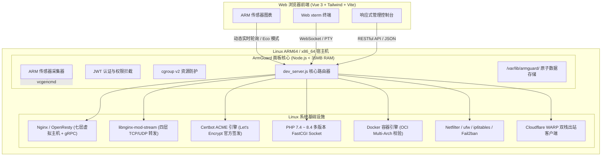

# 🏗️ ArmGuard 系统架构与设计规范

本文档详细描述 **ArmGuard** 的底层设计哲学、核心拓扑架构、进程模型、网络转发与安全防御机制。

---

## 1. 总体架构拓扑 (High-Level Architecture)

ArmGuard 采用极简的解耦设计，面板后端直接与 Linux 内核子系统与主流开源基础设施无缝交互，不依赖重型中间件或庞大的语言运行时：



---

## 2. 进程与资源模型 (Process & Resource Model)

### 2.1 Systemd 服务注册与沙箱隔离
ArmGuard 作为标准的 Linux Systemd 服务运行：
- **服务单元**：`/etc/systemd/system/armguard.service`
- **执行入口**：`/usr/bin/node /opt/armguard/backend/dev_server.js`
- **工作目录**：`/opt/armguard`
- **保活机制**：`Restart=always`，`RestartSec=5s`
- **标准日志**：输出重定向至 `/var/log/armguard/panel.log`

### 2.2 cgroup v2 内存配额防护
为防止在 512MB/1GB 低配树莓派或单板机上由于极端任务占用导致面板自身无响应，服务单元中配置了 cgroup v2 资源配额：
- `MemoryHigh=120M`（当内存触碰阈值时主动触发 GC）
- `MemoryMax=180M`（严格限制硬上限）
- `CPUWeight=100`（避免过度挤占系统关键业务进程）

### 2.3 Eco Mode（智能节能模式）
在仪表盘监控中，ArmGuard 实现了自适应采样算法：
- **高性能主机**：正常提供 2~3 秒的高刷监控动画；
- **低性能单板机 (ARMv7 / 单核 / 电池供电场景)**：触发 Eco Mode 后，面板自适应降低采样周期至 8~10 秒，前端关闭昂贵的波形计算，面板常驻 CPU 开销低于 `0.2%`。

---

## 3. 网络与服务编排规范 (Networking & Orchestration)

### 3.1 七层虚拟主机与 gRPC 编排
所有虚拟主机配置文件标准化存放于 `/etc/nginx/conf.d/<domain>.conf`：
- **双栈监听**：
  ```nginx
  listen <port>;
  listen [::]:<port>;
  ```
- **PHP 多版本 Unix Socket 隔离**：
  FastCGI 直接对接系统 `/run/php/php<version>-fpm.sock`，避免 TCP 本地回环（127.0.0.1:9000）的系统调用与上下文切换开销。
- **gRPC 模式**：
  当开启 gRPC 时，自动下发：
  ```nginx
  listen <port> http2;
  location / {
      grpc_pass <backend_url>;
      grpc_set_header Host $host;
      grpc_read_timeout 300s;
      grpc_send_timeout 300s;
  }
  ```

### 3.2 四层端口转发 (Layer 4 Stream Proxy)
- **模块加载**：在宿主机安装并激活 `libnginx-mod-stream`；
- **顶层隔离**：在 `/etc/nginx/nginx.conf` 顶层注入：
  ```nginx
  stream {
      include /etc/nginx/stream.d/*.conf;
  }
  ```
  保证四层与七层配置完全物理隔离，互不干扰；
- **独立规则**：每条转发规则单独写入 `/etc/nginx/stream.d/stream_<id>.conf`；
- **冲突与保留防护**：后端内置端口冲突探测引擎，针对系统和面板保留端口（`8888`, `22`, `80`, `443`）实行硬编码拦截；
- **高可用平滑切换**：所有规则创建、修改、启停或删除前，均先执行 `nginx -t`。仅在配置预检通过后才执行平滑重载（`systemctl reload nginx`）。

### 3.3 真实 ACME / Certbot 引擎
- **全局穿透规则**：
  在所有站点 80 端口规则（包括 301 强制 HTTPS 跳转块）中注入最高优先级的 ACME 穿透：
  ```nginx
  location ^~ /.well-known/acme-challenge/ {
      default_type "text/plain";
      root /var/www/html;
  }
  ```
  `^~` 保证验证请求优先匹配，不被伪静态、PHP 或反向代理规则劫持。
- **自动化生命周期**：
  Certbot 执行 `--webroot -w /var/www/html` 发起 HTTP-01 验证；颁发后的证书自动同步至 `/etc/ssl/armguard/<domain>/`；后端调用 `openssl x509` 动态提取元数据存入 `/var/lib/armguard/certs.json`。

---

## 4. 数据持久化与原子存储 (Data Persistence)

为避免引入重量级数据库带来的内存膨胀，ArmGuard 采用轻量原子化持久化设计：
- **数据根目录**：`/var/lib/armguard/`
- **核心数据文件**：
  - `sites.json`：虚拟主机配置与反代/gRPC 状态
  - `certs.json`：SSL 证书与权威 CA 签发元数据
  - `stream.json`：四层端口转发规则与启停状态
  - `databases.json`：数据库元数据与备份记录
  - `crontab.json`：计划任务元数据与系统 crontab 映射
  - `settings.json`：面板基础配置、监控周期与告警选项
  - `operations.json`：安全审计日志
- **原子写入机制**：使用内存读写 + 实时 JSON 原子化落盘，确保断电或意外停机时不损坏数据结构。
